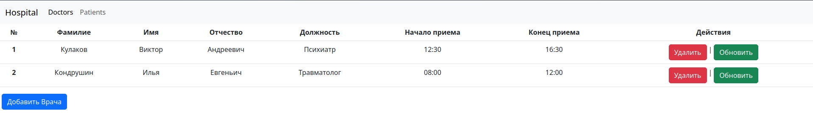
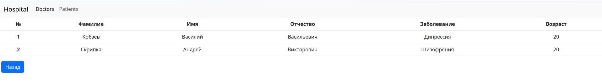
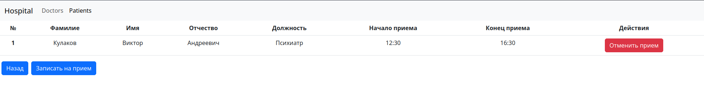
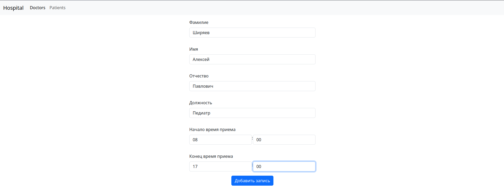
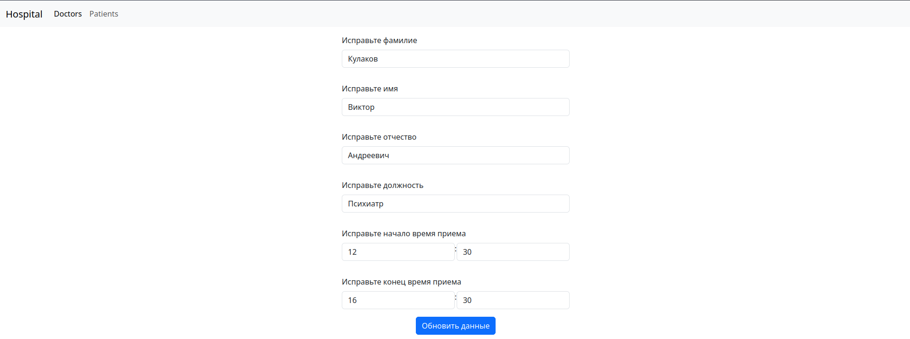
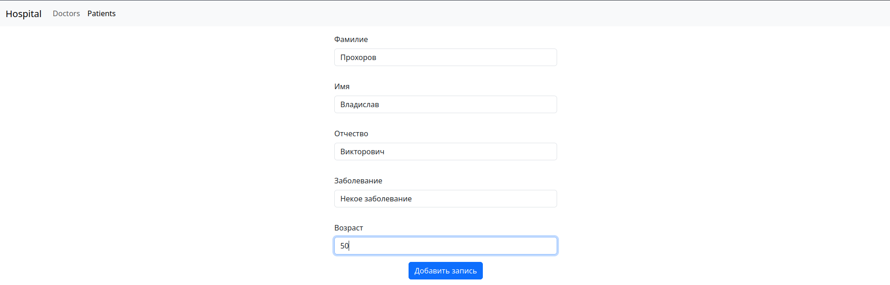
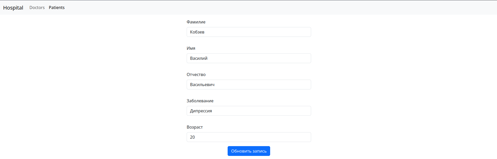
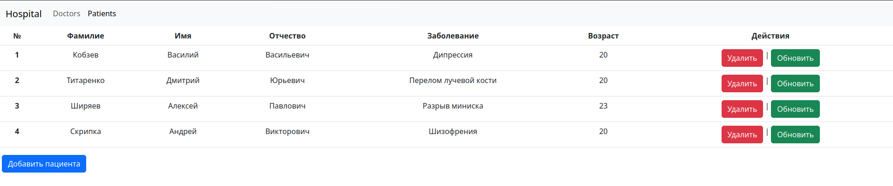
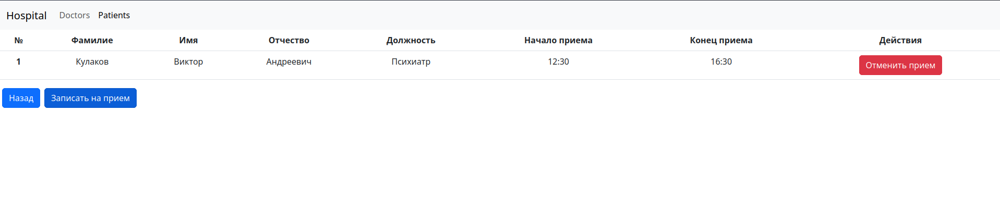
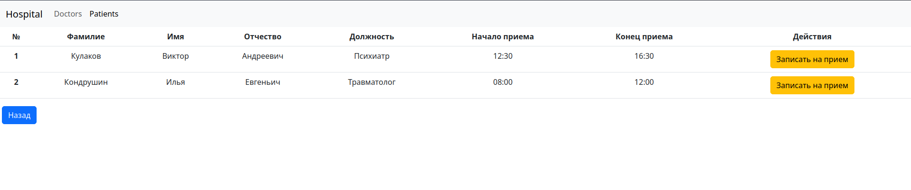

# hospital
Приложение имеет следующий вид:

По нажатию на запись происходит переход от доктора к пациентам и от пациента к докторам:

Так же имеется фунция добавление, обновления и удаления данных:

Для записи пациента на прием нужно выбрать нужного и кликнуть:

Нажать на кнопку "Записаться на прием":

Далее выбрать нужного врача и нажать кнопку "Записать на прием":
